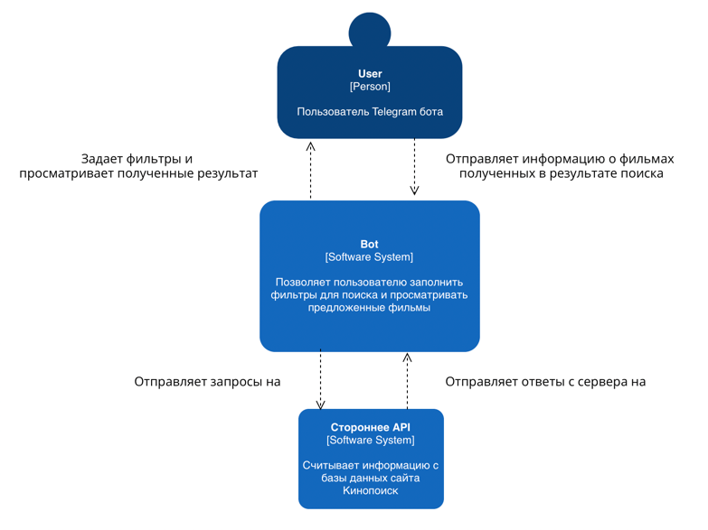
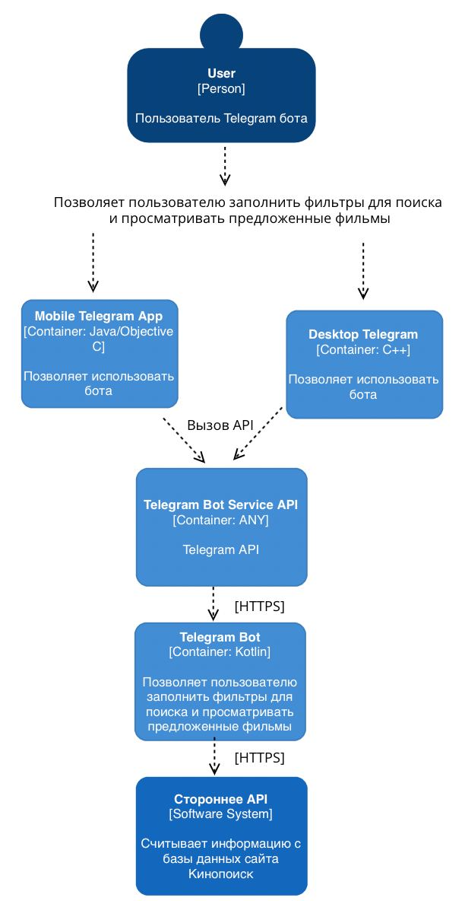

# КиноБот

Телеграм-бот для курса "Конструирование программного обеспечения".
## Проблема

Бывало ли у вас так, что вы хотите посмотреть фильм с друзьями, но не знаете какой? Сколько времени было потрачено
на поиск хорошего фильма? Сколько дружеских связей было сломано? 

Наша команда предлагает уникальное решение на рынке. Мы создали телеграмм-бота, который найдет фильм даже для самого 
большего кино-привереды.

## Цель

Создание телеграмм-бота, который будет советовать фильмы в соответствии со вкусами пользователя, 
даже если он не знает чего он хочет

## Разработчики

Санкт-Петербургский политехнический университет Петра Великого
Институт компьютерных наук и технологий
Высшая школа программной инженерии
3 курс

Группа 3530904/90106

Приложение разрабатывается студентами группы ``3530904/90106``:
* [Анастасия Наумчик](https://github.com/NastyaNaumchik)
* [Георгий Дорохов](https://github.com/dorohovGeorge)

## Используемые технологии
* Kotlin 1.6.0
* Telegram API
* Docker
* Kinopoisk API

## Для запуска необходимо

### Клонировать репозиторий

`` git clone https://github.com/dorohovGeorge/KinoBot.git ``

### Получить токен и вставить его в файл API-KEY.txt в папку src/main/resources

https://kinopoiskapiunofficial.tech

### Создать своего бота и получить его бота у Telegram бота https://t.me/BotFather и вставить в файл BOT_TOKEN.txt в папку src/main/resources 

### Запустить Docker контейнер

`` docker build -t kinobot ./  ``

`` docker run kinobot ``

## Устройство проекта

* Телеграмм бот обрабатывает, передает и получает информацию о фильмах
* Стороннее API которое обрабатывает запросы для поиска информации в базе данных Kinopoisk

## С4 модель

### Первый уровень

### Второй уровень

